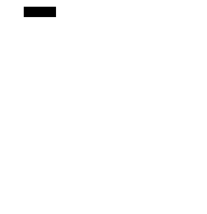

# Pathfinding Algorithms 

Author: [Andrew Gyakobo](https://github.com/Gyakobo)

## Introduction

This project utilizes a randomized-Depth-First-Search approach to generate a maze with a guaranteed solution. 

## Methodology

This algorithm, also known as the "recursive backtracker" algorithm, is a randomized version of the [depth-first search](https://en.wikipedia.org/wiki/Depth-first_search) algorithm.

Frequently implemented with a [stack](https://en.wikipedia.org/wiki/Stack_(abstract_data_type)), this approach is one of the simplest ways to generate a maze using a computer. Consider the space for a maze being a large grid of cells (like a large chess board), each cell starting with four walls. Starting from a random cell, the computer then selects a random neighbouring cell that has not yet been visited. The computer removes the wall between the two cells and marks the new cell as visited, and adds it to the stack to facilitate backtracking. The computer continues this process, with a cell that has no unvisited neighbours being considered a dead-end. When at a dead-end it backtracks through the path until it reaches a cell with an unvisited neighbour, continuing the path generation by visiting this new, unvisited cell (creating a new junction). This process continues until every cell has been visited, causing the computer to backtrack all the way back to the beginning cell. We can be sure every cell is visited.

As given above this algorithm involves deep recursion which may cause stack overflow issues on some computer architectures. The algorithm can be rearranged into a loop by storing backtracking information in the maze itself. This also provides a quick way to display a solution, by starting at any given point and backtracking to the beginning.

Mazes generated with a depth-first search have a low branching factor and contain many long corridors, because the algorithm explores as far as possible along each branch before backtracking.

## Result

Here are 3 maze samples:

This is a 21x21 grid

This is a 40x40 grid

This is a 100x100 grid

## License
MIT